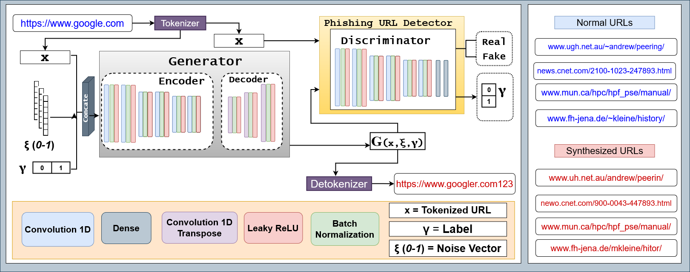

# Semi-supervised-Phishing-Detection-GAN

This code is for our paper "Semi-supervised Conditional GAN for Simultaneous Generation and Detection of Phishing URLs: A Game theoretic Perspective" which is part of the supplementary materials for MICCAI 2021 conference. The paper has since been accpeted and presented at ICMLA 2022.



### Arxiv Pre-print
```
https://arxiv.org/abs/2108.01852
```

# Citation
```
@article{kamran2021semi,
  title={Semi-supervised Conditional GAN for Simultaneous Generation and Detection of Phishing URLs: A Game theoretic Perspective},
  author={Kamran, Sharif Amit and Sengupta, Shamik and Tavakkoli, Alireza},
  journal={arXiv preprint arXiv:2108.01852},
  year={2021}
}
```

## Pre-requisite
- Ubuntu 18.04 / Windows 7 or later
- NVIDIA Graphics card

## Installation Instruction for Ubuntu
- Download and Install [Nvidia Drivers](https://www.nvidia.com/Download/driverResults.aspx/142567/en-us)
- Download and Install via Runfile [Nvidia Cuda Toolkit 10.0](https://developer.nvidia.com/cuda-10.0-download-archive?target_os=Linux&target_arch=x86_64&target_distro=Ubuntu&target_version=1804&target_type=runfilelocal)
- Download and Install [Nvidia CuDNN 7.6.5 or later](https://developer.nvidia.com/rdp/cudnn-archive)
- Install Pip3 and Python3 enviornment
```
sudo apt-get install pip3 python3-dev
```
- Install Tensorflow-Gpu version-2.0.0 and Keras version-2.3.1
```
sudo pip3 install tensorflow-gpu==2.0.0
sudo pip3 install keras==2.3.1
```
- Install packages from requirements.txt
```
sudo pip3 install -r requirements.txt
```

### Dataset download link for Phishing URLs
```
https://www.kaggle.com/taruntiwarihp/phishing-site-urls
```

### NPZ file conversion
- Preprocess all the data to npz format using **data_preprocess.py** file. 
```
python3 data_preprocess.py --url_length=200 --npz_filename='phishing.npz' --n_samples=50000
```
- There are different flags to choose from. Not all of them are mandatory.
```
    '--url_length', type=int, default=200
    '--npz_filename', type=str, default='phishing.npz'
    '--n_sampels',types=int, default=50000,help='number of good and bad samples.'
```

## Training

- Type this in terminal to run the train.py file
```
python3 train.py --npz_file=phishing.npz --batch_size=64 --epochs=200 --savedir=PhishGan --resume_training=no --latent_dim=50
```
- There are different flags to choose from. Not all of them are mandatory

```
   '--epochs', type=int, default=200
   '--batch_size', type=int, default=64
   '--npz_file', type=str, default='phishing.npz', help='path/to/npz/file'
   '--latent_dim', type=int, default=50
   '--savedir', type=str, required=False, help='path/to/save_directory',default='PhishGan'
   '--resume_training', type=str, required=False,  default='no', choices=['yes','no']
   '--weight_name_dis',type=str, help='path/to/discriminator/weight/.h5 file', required=False
   '--weight_name_gen',type=str, help='path/to/generator/weight/.h5 file', required=False
```
